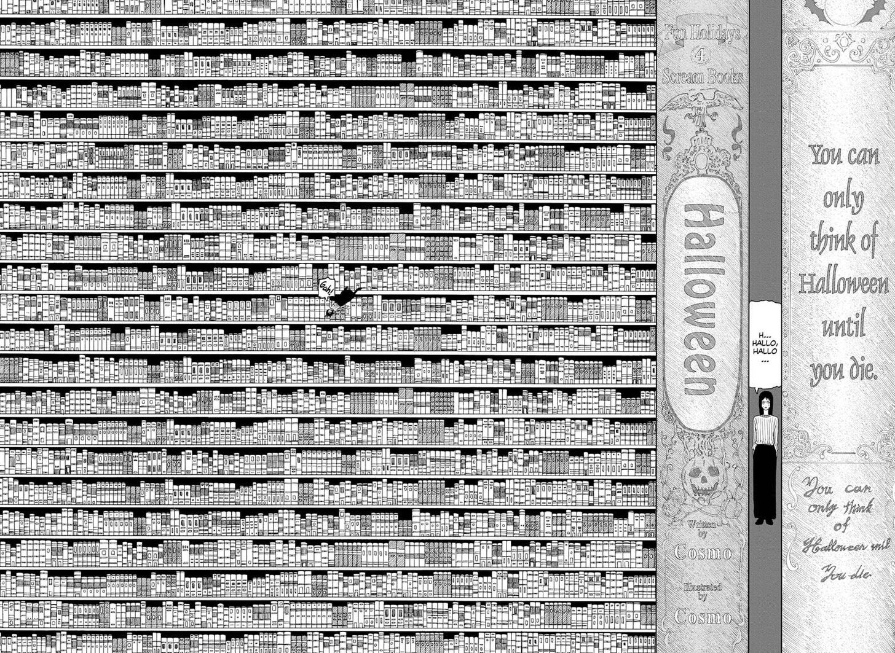

# `Cosmo`

## Usage

```console
$ git clone 
$ cd src
$ love
```

## Architecture


## Reference

The name `Cosmo` is in reference to [Cosmo](https://chainsaw-man.fandom.com/wiki/Cosmo) (コスモ), one of [Quanxi](https://chainsaw-man.fandom.com/wiki/Quanxi)'s girlfriends and the Cosmos [fiend](https://chainsaw-man.fandom.com/wiki/Fiend). She first emerges as a minor antagonist in the [International Assassins arc](https://chainsaw-man.fandom.com/wiki/International_Assassins_arc) in the ongoing manga series [Chainsaw Man](https://chainsaw-man.fandom.com/wiki/Chainsaw_Man_Wiki).

