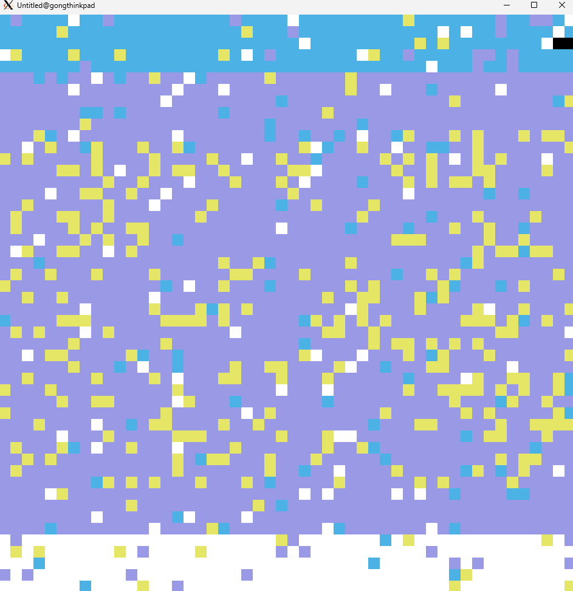

[](https://github.com/gongahkia/cosmo/releases/tag/1.0.0) 

# `Cosmo` 🌌

2D *(top-down)* Terrain Generation, with an emphasis on [investigated and empirically-backed](#research) landscape [evolution](https://en.wikipedia.org/wiki/Evolutionary_landscape).

Rendered with [Löve2d](https://love2d.org/)'s graphics library.

Implemented in [4 hours and 8 minutes](https://github.com/gongahkia/cosmo/commit/f8a10714c84885cf78526c57c324dbc09416e67e).

## Usage

First run the below.

```console
$ git clone https://github.com/gongahkia/cosmo
$ cd cosmo
$ make
$ love src
```

Then press the corresponding [key](#keypress) to [generate](#architecture) and visualize [terrain](#screenshots).

## Architecture


## Screenshots

### Coastline, Volcanic Archipelago, Desert Dunes

<div style="display: flex; justify-content: space-between;">
  
  
  
</div>

### Glacial Valley, Urban Grid, Swamp

<div style="display: flex; justify-content: space-between;">
  
  
  
</div>

### Cave Network, River Basin, Floating Islands

<div style="display: flex; justify-content: space-between;">
  
  
  
</div>

### Forest Temple, Tundra Biome, Coral Reef

<div style="display: flex; justify-content: space-between;">
  
  
  
</div>

### Megastructure, Farmland, Apocalyptic Wasteland

<div style="display: flex; justify-content: space-between;">
  
  
  
</div>

## Keypress

| Key | Description |
| :--- | :--- |
| `b` | [Coastline](#coastline-volcanic-archipelago-desert-dunes) |
| `v` | [Volcanic Archipelago](#coastline-volcanic-archipelago-desert-dunes) |
| `d` | [Desert](#coastline-volcanic-archipelago-desert-dunes) |
| `g` | [Glacial Valley](#glacial-valley-urban-grid-swamp) |
| `u` | [Urban Cityscape Grid](#glacial-valley-urban-grid-swamp) |
| `s` | [Swamp Ecosystem](#glacial-valley-urban-grid-swamp) |
| `c` | [Cave System](#cave-network-river-basin-floating-islands) |
| `r` | [River Basin Network](#cave-network-river-basin-floating-islands) |
| `i` | [Floating Islands](#cave-network-river-basin-floating-islands) |
| `t` | [Ancient Forest Temple](#forest-temple-tundra-coral-reef) |
| `n` | [Tundra Biome](#forest-temple-tundra-coral-reef) |
| `o` | [Coral Reefs](#forest-temple-tundra-coral-reef) |
| `m` | [Megastructure](#megastructure-farmland-apocalyptic-wasteland) |
| `f` | [Agricultural Farmland](#megastructure-farmland-apocalyptic-wasteland) |
| `a` | [Apocalyptic Wasteland](#megastructure-farmland-apocalyptic-wasteland) |
| `p` | [Mountain Range](#additional-terrain-types) |
| `e` | [Dense Forest](#additional-terrain-types) |
| `y` | [Canyon System](#additional-terrain-types) |
| `h` | [Archipelago](#additional-terrain-types) |
| `l` | [Badlands](#additional-terrain-types) |

## Additional Terrain Types

Five new terrain generators have been added to expand the variety of landscapes:

### Mountain Range (`p`)
- **Features**: Snow-capped peaks, rocky slopes, forested foothills
- **Algorithm**: Multi-peak generation with elevation gradients and ridge formation
- **Terrain Types**: Snow (A), Mountain (M), Rock (R), Forest (F), Grass (G)

### Dense Forest (`e`)
- **Features**: Thick woodland with clearings, flowing rivers, varied tree density
- **Algorithm**: Density-based forest distribution with clearing generation and river systems
- **Terrain Types**: Dark Forest (E), Forest (F), Trees (T), Grass (G), Water (W), Sand (S)

### Canyon System (`y`)
- **Features**: Deep canyon channels, tributary networks, steep walls
- **Algorithm**: Erosion simulation with main channel and tributary carving
- **Terrain Types**: Water (W), Sand (S), Rock (R), Mountain (M), Orange Sand (O), Dirt (D)

### Archipelago (`h`)
- **Features**: Multiple islands, atolls, shallow waters, varied island sizes
- **Algorithm**: Multi-island generation with distance-based elevation and atoll formation
- **Terrain Types**: Deep Water (B), Shallow Water (W), Beach (O/S), Forest (F), Rock (R), Mountain (M)

### Badlands (`l`)
- **Features**: Mesa formations, stratified rock layers, arroyos, arid terrain
- **Algorithm**: Mesa placement with stratification effects and erosion channels
- **Terrain Types**: Rock (R), Clay (K), Orange Sand (O), Gravel (X), Dirt (D), Sand (S), Water (W)

## Testing

A comprehensive test suite has been implemented to ensure terrain generator quality and consistency:

### Running Tests

```console
$ lua test/run_tests.lua
```

### Test Framework Features

- **Generator Validation**: Ensures all generators produce valid terrain maps with correct dimensions
- **Character Validation**: Verifies only valid terrain characters are used
- **Terrain Diversity**: Tests that generators produce varied and interesting landscapes
- **Connectivity Analysis**: Analyzes terrain feature connectivity and distribution
- **Cross-Generator Consistency**: Ensures all generators follow the same interface standards

### Test Structure

- `test/test_framework.lua` - Core testing framework with assertions
- `test/test_helpers.lua` - Utility functions for terrain analysis
- `test/test_generators.lua` - Comprehensive generator tests
- `test/test_helpers_test.lua` - Tests for the testing utilities
- `test/run_tests.lua` - Test runner script

## Reference

The name `Cosmo` is in reference to [Cosmo](https://chainsaw-man.fandom.com/wiki/Cosmo) (コスモ), one of [Quanxi](https://chainsaw-man.fandom.com/wiki/Quanxi)'s girlfriends and the Cosmos [fiend](https://chainsaw-man.fandom.com/wiki/Fiend). She first emerges as a minor antagonist in the [International Assassins arc](https://chainsaw-man.fandom.com/wiki/International_Assassins_arc) in the ongoing manga series [Chainsaw Man](https://chainsaw-man.fandom.com/wiki/Chainsaw_Man_Wiki).


## Research

* [*Neotectonics on the Arabian Sea coasts*](https://www.researchgate.net/publication/249551040_Neotectonics_on_the_Arabian_Sea_coasts) by Claudio Vita-Finzi
* [*A model for Aeolian-driven land surface processes with consideration of porous sand fences.*](https://ui.adsabs.harvard.edu/abs/2022AGUFMEP25D1428R/abstract) by Ribeiro Parteli and Eric Josef
* [*Controlled Procedural Terrain Generation Using Software Agents*](https://www.researchgate.net/publication/224133576_Controlled_Procedural_Terrain_Generation_Using_Software_Agents) by Jonathon Doran and Ian Parberry
* [*Simulating Social and Economic Specialization in Small-Scale Agricultural Societies*](https://www.researchgate.net/publication/257932682_Simulating_Social_and_Economic_Specialization_in_Small-Scale_Agricultural_Societies) by Denton Cockburn, Stefani A Crabtree, Ziad Kobti and Tim Kohler
* [*The Ecological and Environmental Significance of Urban Wastelands and Drosscapes*](https://www.researchgate.net/publication/299781286_The_Ecological_and_Environmental_Significance_of_Urban_Wastelands_and_Drosscapes) by Colin Michael Hall
* [*The algorithmic beauty of plant roots – an L-System model for dynamic root growth simulation*](https://www.researchgate.net/publication/225093378_The_algorithmic_beauty_of_plant_roots_-_an_L-System_model_for_dynamic_root_growth_simulation) by Daniel Leitner, Sabine Klepsch, Astrid Knieß and Andrea Schnepf
* [*Modeling Hydrologic and Vegetation Responses in Freshwater Wetlands*](https://www.researchgate.net/publication/234423920_Modeling_Hydrologic_and_Vegetation_Responses_in_Freshwater_Wetlands) by Ting Fong May Chui, Swee Yang Low and Shie-Yui Liong
* [*Evaluation of Grid Pattern City in Tropical Zone Considering Urban Morphology Viewing from Shading Aspect*](https://www.researchgate.net/publication/349363260_Evaluation_of_Grid_Pattern_City_in_Tropical_Zone_Considering_Urban_Morphology_Viewing_from_Shading_Aspect) by K M Mo 0f and Nobuo Mishima
* [*Terrain Generation Using Procedural Models Based on Hydrology*](https://www.researchgate.net/publication/248703095_Terrain_Generation_Using_Procedural_Models_Based_on_Hydrology) by Jean-David Génevaux, Eric Galin, Eric Guérin and Adrien Peytavie

## Other notes

`Cosmo` was heavily inspired by tools like [World Machine](https://www.world-machine.com/) and [World Creator](https://www.world-creator.com/).
