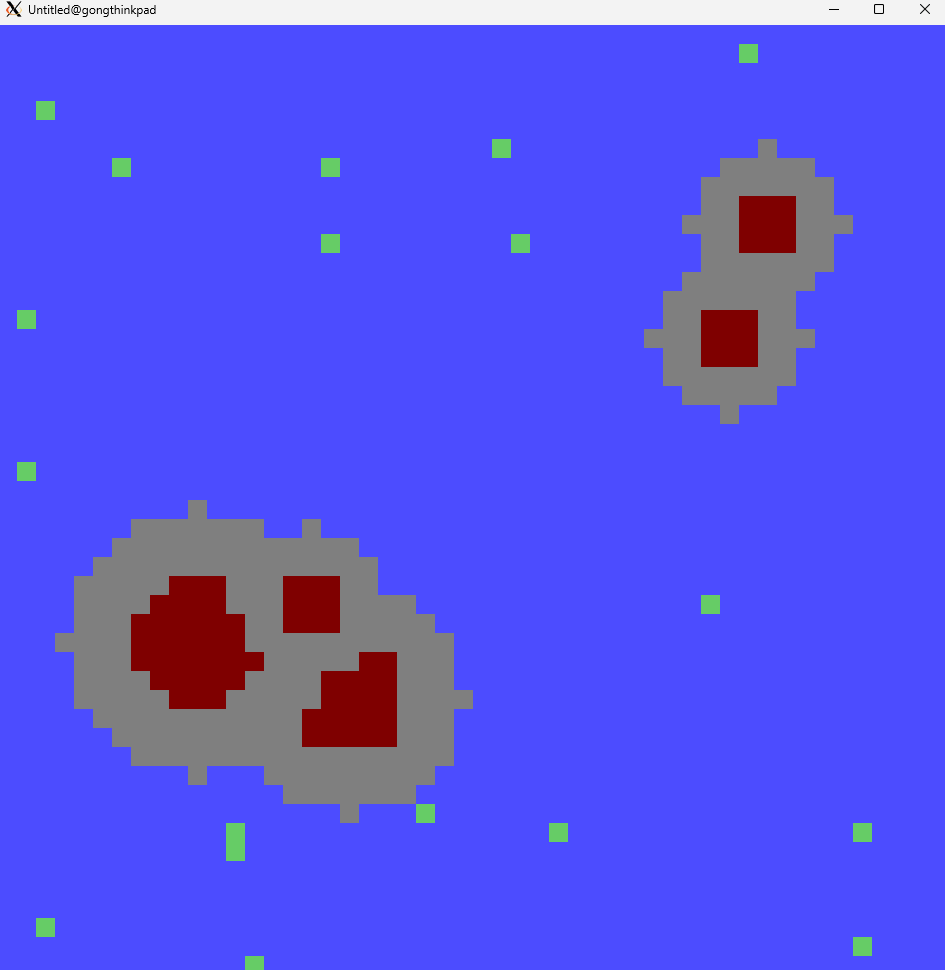
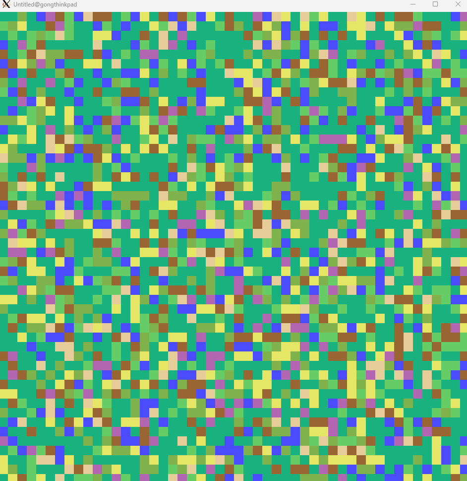
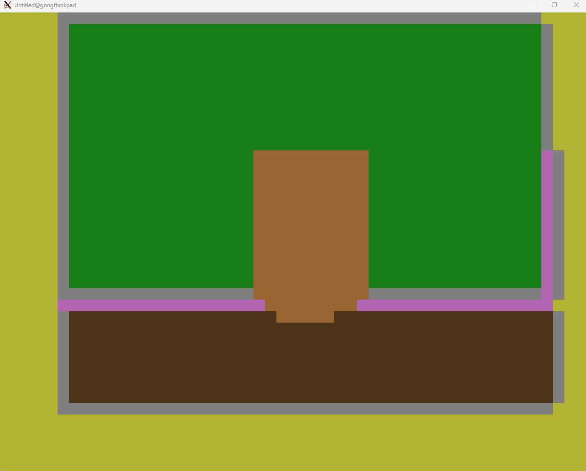
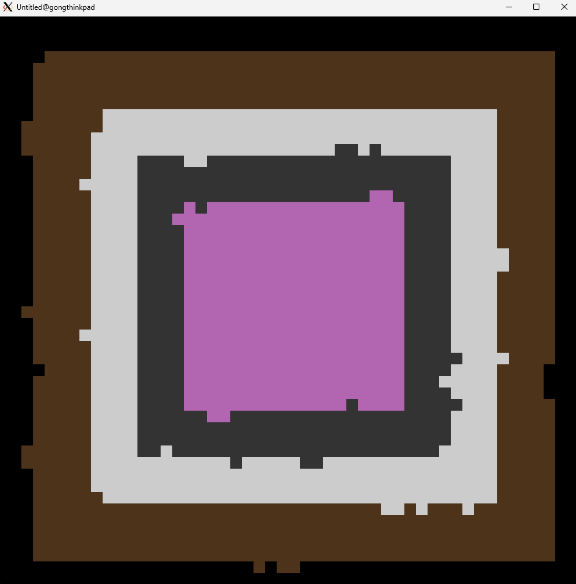

[](https://github.com/gongahkia/cosmo/releases/tag/1.0.0) 

# `Cosmo`

...

## Usage

First run the below.

```console
$ git clone https://github.com/gongahkia/cosmo
$ make
$ love src
```

Then press the corresponding [key](#keypress) to generate and visualize [terrain](#screenshots).

## Architecture


## Screenshots

### Coastline, Volcanic Archipelago, Desert Dunes

<div style="display: flex; justify-content: space-between;">
  
  
  
</div>

### Glacial Valley, Urban Grid, Swamp

<div style="display: flex; justify-content: space-between;">
  
  
  
</div>

### Cave Network, River Basin, Floating Islands

<div style="display: flex; justify-content: space-between;">
  
  
  
</div>

### Forest Temple, Tundra Biome, Coral Reef

<div style="display: flex; justify-content: space-between;">
  
  
  
</div>

### Megastructure, Farmland, Apocalyptic Wasteland

<div style="display: flex; justify-content: space-between;">
  
  
  
</div>

## Keypress

| Key | Description |
| :--- | :--- |
| `b` | [Coastline](#coastline-volcanic-archipelago-desert-dunes) |
| `v` | [Volcanic Archipelago](#coastline-volcanic-archipelago-desert-dunes) |
| `d` | [Desert](#coastline-volcanic-archipelago-desert-dunes) |
| `g` | [Glacial Valley](#glacial-valley-urban-grid-swamp) |
| `u` | [Urban Cityscape Grid](#glacial-valley-urban-grid-swamp) |
| `s` | [Swamp Ecosystem](#glacial-valley-urban-grid-swamp) |
| `c` | [Cave System](#cave-network-river-basin-floating-islands) |
| `r` | [River Basin Network](#cave-network-river-basin-floating-islands) |
| `i` | [Floating Islands](#cave-network-river-basin-floating-islands) |
| `t` | [Ancient Forest Temple](#forest-temple-tundra-coral-reef) |
| `n` | [Tundra Biome](#forest-temple-tundra-coral-reef) |
| `o` | [Coral Reefs](#forest-temple-tundra-coral-reef) |
| `m` | [Megastructure](#megastructure-farmland-apocalyptic-wasteland) |
| `f` | [Agricultural Farmland](#megastructure-farmland-apocalyptic-wasteland) |
| `a` | [Apocalyptic Wasteland](#megastructure-farmland-apocalyptic-wasteland) |

## Reference

The name `Cosmo` is in reference to [Cosmo](https://chainsaw-man.fandom.com/wiki/Cosmo) (コスモ), one of [Quanxi](https://chainsaw-man.fandom.com/wiki/Quanxi)'s girlfriends and the Cosmos [fiend](https://chainsaw-man.fandom.com/wiki/Fiend). She first emerges as a minor antagonist in the [International Assassins arc](https://chainsaw-man.fandom.com/wiki/International_Assassins_arc) in the ongoing manga series [Chainsaw Man](https://chainsaw-man.fandom.com/wiki/Chainsaw_Man_Wiki).


## Research

* 
* 
* 
* 
* 